<div align="center">

<!-- ========================================================================= -->
<!-- HERO ANIMATED DEV BANNER (CUSTOM HIGH-TECH CYBERPUNK SVG) -->
<!-- ========================================================================= -->
<a href="https://nabdullah.vercel.app/">
  
</a>

<br/><br/>

<!-- ========================================================================= -->
<!-- DYNAMIC TYPING NAME & TITLE -->
<!-- ========================================================================= -->
<a href="https://nabdullah.vercel.app/">
  
</a>

<br/>

<!-- ========================================================================= -->
<!-- QUICK BADGES & SOCIAL LINKS -->
<!-- ========================================================================= -->
<p align="center">
  <a href="https://nabdullah.vercel.app/" target="_blank">
    
  </a>
  <a href="https://www.linkedin.com/in/abdullah-al-noman-0540402a8" target="_blank">
    
  </a>
  <a href="mailto:abdullahcse.cou14@gmail.com" target="_blank">
    
  </a>
  <a href="https://codeforces.com/profile/nomanabdullah04" target="_blank">
    
  </a>
  <a href="https://github.com/nomanabdullah04">
    
  </a>
</p>

<!-- CYBER DIVIDER -->


</div>

### 💫 About Me

```yaml
name: Abdullah Al Noman
role: AI & Deep Learning Specialist | Full-Stack Software Engineer
education: B.Sc. in Computer Science & Engineering (CSE) @ Comilla University (CoU)
location: Bangladesh 🇧🇩
passions: [Neural Architectures, MLOps Automation, High-Performance Web Apps, Problem Solving]
current_focus: [Advanced NLP, Computer Vision, End-to-End MLOps Pipelines (BentoML/MLflow)]
philosophy: "My style is not just about what I wear, it's about how I live."
```

- 🔭 I’m currently engineering scalable **Machine Learning & Deep Learning** systems with full-lifecycle **MLOps** deployment.
- 💡 Passionate about turning complex real-world challenges into intuitive, high-performance web and AI applications.
- 🚀 Created [CampusNexus](https://campus-nexus-six.vercel.app) & [Coffee or Tea](https://coffee-or-tea.vercel.app).
- 🏆 Actively sharpening algorithmic thinking and data structure mastery through **Competitive Programming** in C++.
- 💬 Reach out to me about: **Deep Learning, Neural Networks, React & Node.js, PyTorch, Docker, or Algorithms**!

<div align="center">
  
</div>

### 🛠️ Tech Stack & Arsenal

<div align="center">

<!-- AI, ML & DATA SCIENCE -->

<br/>
<a href="https://skillicons.dev">
  
</a>

<br/><br/>

<!-- MLOPS & CLOUD / DEVOPS -->

<br/>
<a href="https://skillicons.dev">
  
</a>

<br/><br/>

<!-- FULL STACK DEVELOPMENT -->

<br/>
<a href="https://skillicons.dev">
  
</a>

<br/><br/>

<!-- PROGRAMMING LANGUAGES, DATABASES & TOOLS -->

<br/>
<a href="https://skillicons.dev">
  
</a>

<br/>


</div>

### 🚀 Featured Works & Breakthroughs

<table>
  <tr>
    <td width="50%" valign="top">
      <h3 align="center">🏢 CampusNexus</h3>
      <p align="center">
        <a href="https://campus-nexus-six.vercel.app" target="_blank">
          
        </a>
        <a href="https://github.com/nomanabdullah04/CampusNexus" target="_blank">
          
        </a>
      </p>
      <p>A full-featured modern web platform engineered for campus rental systems and student accommodation search with responsive UI and sleek interactions.</p>
      <p>
        
        
        
      </p>
    </td>
    <td width="50%" valign="top">
      <h3 align="center">☕ Coffee or Tea</h3>
      <p align="center">
        <a href="https://coffee-or-tea.vercel.app" target="_blank">
          
        </a>
        <a href="https://github.com/nomanabdullah04/Coffee_Or_Tea" target="_blank">
          
        </a>
      </p>
      <p>An interactive, multi-stage gamified experience built with animated messengers, dynamic food selections, interactive audio effects, and celebration stages.</p>
      <p>
        
        
        
      </p>
    </td>
  </tr>
  <tr>
    <td width="50%" valign="top">
      <h3 align="center">🧠 End-to-End Deep Learning Suite</h3>
      <p align="center">
        <a href="https://github.com/nomanabdullah04/End_To_End-DeepLearning-Project-by-ANN" target="_blank">
          
        </a>
        <a href="https://github.com/nomanabdullah04/DeepLearning" target="_blank">
          
        </a>
      </p>
      <p>End-to-End deep neural networks built with Artificial Neural Networks (ANN), regression/classification models, model optimization, and deployment pipelines.</p>
      <p>
        
        
        
      </p>
    </td>
    <td width="50%" valign="top">
      <h3 align="center">🔄 MLOps Ecosystem</h3>
      <p align="center">
        <a href="https://github.com/nomanabdullah04/BentoML" target="_blank">
          
        </a>
        <a href="https://github.com/nomanabdullah04/MLFlow" target="_blank">
          
        </a>
        <a href="https://github.com/nomanabdullah04/Data-Version-Control" target="_blank">
          
        </a>
      </p>
      <p>Robust machine learning operations pipeline implementing model versioning, experiment tracking, reproducible data versioning, containerization, and microservice serving.</p>
      <p>
        
        
        
      </p>
    </td>
  </tr>
</table>

<div align="center">
  
</div>

### 📊 GitHub Activity & Analytics

<div align="center">

<!-- GITHUB STREAK STATS -->
<a href="https://github.com/nomanabdullah04">
  
</a>

<br/><br/>

<!-- PROFILE SUMMARY STATS CARDS -->
<a href="https://github.com/nomanabdullah04">
  
</a>
<a href="https://github.com/nomanabdullah04">
  
</a>

<br/><br/>

<!-- TOP LANGUAGES COMMITS & REPOS -->
<a href="https://github.com/nomanabdullah04">
  
</a>
<a href="https://github.com/nomanabdullah04">
  
</a>

<br/>


</div>

### ⚡ Dev Laugh & Wisdom

<div align="center">

<a href="https://github.com/nomanabdullah04">
  
</a>

</div>

---

<!-- ========================================================================= -->
<!-- FOOTER & CONNECT -->
<!-- ========================================================================= -->
<div align="center">

<h3>🤝 Let's Connect & Build the Future!</h3>

<p>
  <a href="https://nabdullah.vercel.app/" target="_blank">
    
  </a>
  &nbsp;
  <a href="https://www.linkedin.com/in/abdullah-al-noman-0540402a8" target="_blank">
    
  </a>
  &nbsp;
  <a href="mailto:abdullahcse.cou14@gmail.com">
    
  </a>
</p>

<p><i>⭐️ From <b>Abdullah Al Noman</b> — Never stop learning, innovating, and shipping! ⭐️</i></p>


</div>
